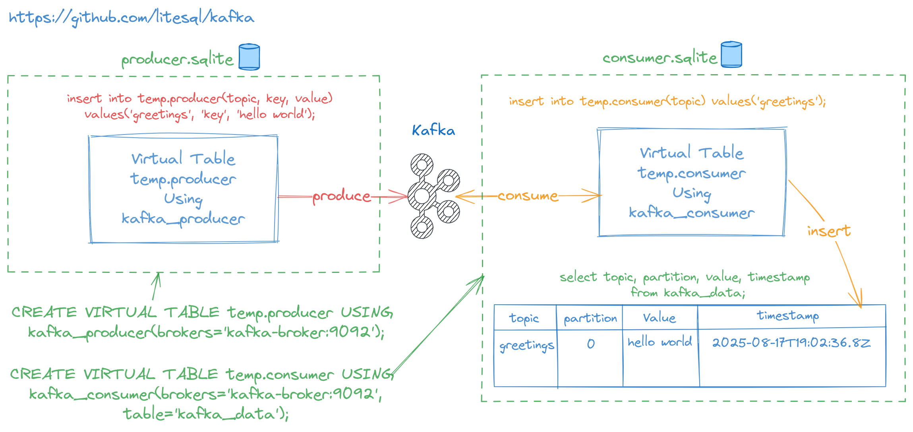

# sqlite-kafka
SQLite Extension to integrate with Kafka brokers.



## Installation

Download **kafka** extension from the [releases page](https://github.com/litesql/kafka/releases).
Here's a great article that explains [how to install the SQLite extension.](https://antonz.org/install-sqlite-extension/)

### Compiling from source

- [Go 1.24+](https://go.dev) and CGO_ENABLED=1 is required.

```sh
go build -ldflags="-s -w" -buildmode=c-shared -o kafka.so
```

- Use .so extension for Linux, .dylib for MacOS and .dll for Windows

## Basic usage

### Loading the extension

```sh
sqlite3

# Load the extension
.load ./kafka

# check version (optional)
SELECT kafka_info();
```

### Consumer

```sh
# Create a virtual table using KAFKA_CONSUMER to configure the connection to the broker
CREATE VIRTUAL TABLE temp.consumer USING kafka_consumer(brokers='localhost:44475', consumer_group='sqlite-kafka');

# Insert the topic name into the created virtual table to subscribe
INSERT INTO temp.consumer(topic) VALUES('my_topic');

# To start consuming a partition at specific offset. Example:
# partition 0 at earliest offset
# partition 1 at latest offset
# partition 2 at offset 42
INSERT INTO temp.consumer(topic, offsets) VALUES('my_topic', 
'{
  "0": "earliest", 
  "1": "latest",
  "2": "42"
}');
```

Consumer table schema:

```sql
TABLE temp.consumer(
  topic TEXT,
  offsets JSONB
)
```

### Producer

```sh
# Create a virtual table using KAFKA_PRODUCER to configure the connection to the broker
CREATE VIRTUAL TABLE temp.producer USING kafka_producer(brokers='localhost:44475');

# Insert data into the created virtual table to produce messages
INSERT INTO temp.producer(topic, key, value) VALUES('my_topic', 'hello', 'world');
```

Producer table schema:

```sql
TABLE temp.producer(
  topic TEXT,   
  key BLOB, 
  value BLOB,
  headers JSONB
)
```

### Stored messages

```sh
# Set output mode (optional)
.mode qbox

# Query for the incoming messages
SELECT topic, key, value, timestamp FROM kafka_data;
┌────────────┬─────────┬─────────┬───────────────────────────────┐
│   topic    │   key   │  value  │           timestamp           │
├────────────┼─────────┼─────────┼───────────────────────────────┤
│ 'my_topic' │ 'hello' │ 'world' │ '2025-08-17T00:02:00.8-03:00' │
└────────────┴─────────┴─────────┴───────────────────────────────┘
```

Incoming messages are stored in tables according to the following schema:

```sql
TABLE kafka_data(
  topic TEXT,
  partition INTEGER,
  key TEXT,
  value BLOB,
  headers JSONB,
  offset INTEGER,
  timestamp DATETIME
)
```

### Subscriptions management

Query the subscription virtual table (the virtual table created using **kafka_consumer**) to view all the active subscriptions for the current SQLite connection.

```sql
SELECT topic FROM temp.consumer;
┌────────────┐
│   topic    │
├────────────┤
│ 'my_topic' │
└────────────┘
```

Delete the row to unsubscribe from the topic:

```sql
DELETE FROM temp.consumer WHERE topic = 'my_topic';
```

#### Set offsets

To set the consumer's partition offsets (using consumer group), just update the offsets column:

```sql
SELECT topic, offsets FROM temp.consumer;
┌────────────┬─────────────────────────────────┐
│   topic    │             offsets             │
├────────────┼─────────────────────────────────┤
│ 'my_topic' │ '{"0":{"Epoch":0,"Offset":36}}' │
└────────────┴─────────────────────────────────┘

UPDATE temp.consumer SET offsets = '{"0":{"Epoch":0,"Offset":12}}' WHERE topic = 'my_topic';
```

## Configuring

You can configure the connection to the broker by passing parameters to the VIRTUAL TABLE.

| Param | P/C/B | Description | Default |
|-------|------|-------------|---------|
| brokers | Both | Comma delimited list of seed brokers | localhost:9092 |
| client_id | Both | Client ID  | sqlite |
| timeout | Producer | Producer timeout | 10s (10 seconds) |
| flush_on_commit | Producer | Disable auto-flush and exec flush on commit | false |
| max_buffered_records | Producer | Max producer buffered records | 10000 |
| transactional_id | Producer | Transactional ID (if not empty enable transaction API support) | |
| transaction_timeout | Producer | Transaction timeout | 45s |
| consumer_group | Consumer | Consumer group | |
| isolation_level | Consumer | Fetch isolation level. 0 = read uncommitted, 1 = read committed | 0 |
| auto_offset_reset | Consumer | Determines the behavior of a consumer group when there is no valid committed offset for a partition. (latest, earliest or none) | |
| table | Consumer | Name of the table where incoming messages will be stored. | kafka_data |
| sasl_type | Both | SASL type: plain, sha256 or sha512 | |
| sasl_user | Both | SASL user | |
| sasl_pass | Both | SASL pass | |
| insecure | Both | Insecure skip TLS validation |  |
| cert_file | Both | TLS: Path to certificate file | |
| cert_key_file | Both | TLS: Path to certificate key file | |
| ca_file | Both | TLS: Path to CA certificate file | |
| logger | Both | Log errors to stdout, stderr or file:/path/to/file.log |
